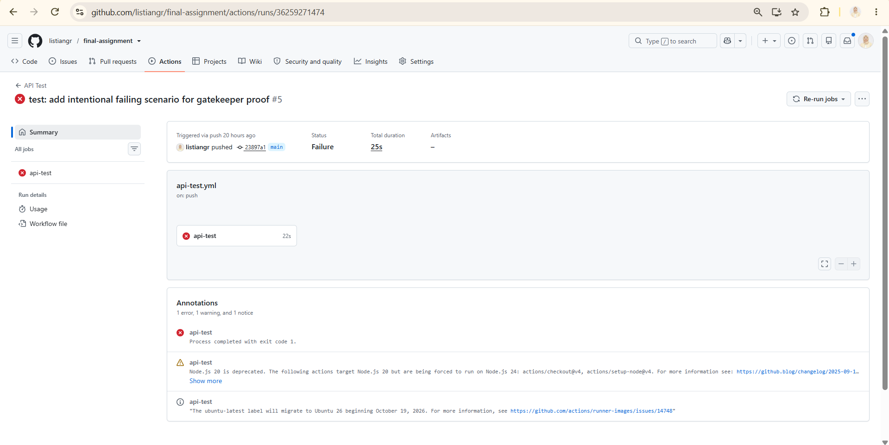
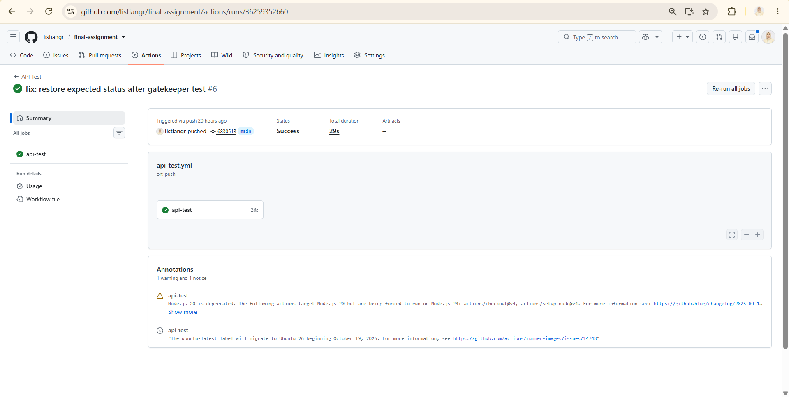

# Final Assignment - API Testing

Final assignment untuk API testing menggunakan Postman, Newman, data-driven testing, authentication token handling, assertion, dan GitHub Actions.

## Project Structure

```text
final-assignment/
├── .github/
│   └── workflows/
│       └── api-test.yml
├── data/
│   └── final-assignment.csv
├── postman/
│   ├── final-assignment.postman_collection.json
│   └── final-assignment.postman_environment.json
└── README.md
```

## Requirements

Pastikan sudah terinstall:

- Node.js
- npm
- Newman

Install Newman:

```bash
npm install -g newman
```

Cek versi Newman:

```bash
newman --version
```

## Run Main API Tests

Main API test menjalankan folder `Authentication` dan `Script Labs`.

```bash
newman run ./postman/final-assignment.postman_collection.json \
  -e ./postman/final-assignment.postman_environment.json \
  --folder "Authentication" \
  --folder "Script Labs" \
  --env-var "email=<API_EMAIL>" \
  --env-var "password=<API_PASSWORD>"
```

Contoh menggunakan credential test:

```bash
newman run ./postman/final-assignment.postman_collection.json \
  -e ./postman/final-assignment.postman_environment.json \
  --folder "Authentication" \
  --folder "Script Labs" \
  --env-var "email=standard_user@example.com" \
  --env-var "password=script_sauce"
```

Main API test mencakup:

- Login success
- Login failed
- Create lab
- Duplicate lab
- Get all labs
- Unauthorized request
- Get lab detail
- Lab not found
- Search lab
- Update lab
- Invalid update payload
- Delete lab

## Run Data-Driven Tests

Data-driven test menggunakan file CSV:

```text
data/final-assignment.csv
```

Jalankan dengan command:

```bash
newman run ./postman/final-assignment.postman_collection.json \
  -e ./postman/final-assignment.postman_environment.json \
  -d ./data/final-assignment.csv \
  --folder "Data Driven" \
  --env-var "email=<API_EMAIL>" \
  --env-var "password=<API_PASSWORD>"
```

Contoh menggunakan credential test:

```bash
newman run ./postman/final-assignment.postman_collection.json \
  -e ./postman/final-assignment.postman_environment.json \
  -d ./data/final-assignment.csv \
  --folder "Data Driven" \
  --env-var "email=standard_user@example.com" \
  --env-var "password=script_sauce"
```

Data-driven testing menggunakan tiga skenario:

- Valid
- Invalid
- Edge case

Struktur CSV:

```csv
scenario,csv_title,csv_description,expected_status
valid,API Testing Lab,Created from data driven testing,201
invalid,Invalid Lab,,400
edge_case,ABCDEFGHIJKLMNOPQRSTUVWXYZ1234567890,Edge case description with special chars !@#$%^&*(),201
```

Untuk menghindari duplicate data saat test dijalankan berkali-kali, title pada request data-driven menggunakan timestamp:

```json
{
  "title": "{{csv_title}} {{$timestamp}}",
  "description": "{{csv_description}}"
}
```

## Authentication and Token Handling

Request login dijalankan untuk mendapatkan token autentikasi.

Token dari response login disimpan secara otomatis ke environment variable:

```javascript
const response = pm.response.json();

pm.environment.set("token", response.data.token);
```

Request `/api/labs` kemudian menggunakan token tersebut sebagai Bearer Token:

```text
Bearer {{token}}
```

Token tidak di-hardcode secara manual pada setiap request.

## Test Assertions

Setiap request memiliki assertion untuk memvalidasi response API.

Assertion yang digunakan antara lain:

- Status code
- Response time
- Content-Type
- Response body
- Response field
- Success response
- Error response
- Pagination
- Data hasil create/update/delete

Contoh assertion:

```javascript
pm.test("Status code is 200", function () {
    pm.response.to.have.status(200);
});

pm.test("Response time is below 10000 ms", function () {
    pm.expect(pm.response.responseTime).to.be.below(10000);
});

pm.test("Response Content-Type is JSON", function () {
    pm.expect(pm.response.headers.get("Content-Type"))
        .to.include("application/json");
});
```

Threshold response time dibuat lebih longgar untuk menghindari flaky test saat berjalan menggunakan GitHub-hosted runner.

## GitHub Actions

Workflow CI berada di:

```text
.github/workflows/api-test.yml
```

Workflow otomatis berjalan pada:

```yaml
on:
  push:
    branches:
      - main

  pull_request:
    branches:
      - main
```

Workflow menjalankan proses:

1. Checkout repository
2. Setup Node.js
3. Install Newman
4. Run main API tests
5. Run data-driven API tests

Jika terdapat assertion yang gagal, Newman menghasilkan exit code selain `0` dan GitHub Actions akan menandai pipeline sebagai failed.

## GitHub Secrets

Credential login tidak di-hardcode di file workflow.

Credential disimpan menggunakan GitHub Actions Repository Secrets:

```text
API_EMAIL
API_PASSWORD
```

Lokasi konfigurasi:

```text
Repository
→ Settings
→ Secrets and variables
→ Actions
→ Repository secrets
```

Workflow menggunakan secret tersebut saat menjalankan Newman:

```yaml
--env-var "email=${{ secrets.API_EMAIL }}"
--env-var "password=${{ secrets.API_PASSWORD }}"
```

Environment JSON yang disimpan di repository tidak menyimpan credential login:

```json
{
  "key": "email",
  "value": "",
  "type": "default",
  "enabled": true
},
{
  "key": "password",
  "value": "",
  "type": "default",
  "enabled": true
}
```

## Gatekeeper Test

Pipeline juga diuji menggunakan intentional failing scenario untuk membuktikan bahwa GitHub Actions dapat berfungsi sebagai gatekeeper.

Skenario valid pada CSV seharusnya memiliki expected status:

```text
201
```

Untuk pengujian gatekeeper, nilai tersebut sengaja diubah menjadi:

```text
500
```

Contoh:

```csv
scenario,csv_title,csv_description,expected_status
valid,API Testing Lab,Created from data driven testing,500
```

API tetap menghasilkan:

```text
201 Created
```

Sedangkan assertion mengharapkan:

```text
500
```

Akibatnya Newman menghasilkan assertion failure dan GitHub Actions menjadi merah.

Setelah bukti failure diperoleh, nilai tersebut dikembalikan menjadi:

```text
201
```

Kemudian pipeline dijalankan kembali dan berhasil menjadi hijau.

Hal ini membuktikan bahwa pipeline dapat mencegah perubahan yang menyebabkan automated test gagal.

## CI Result

Pipeline berhasil menjalankan:

- Authentication testing
- Token handling
- CRUD API testing
- Positive testing
- Negative testing
- Data-driven testing
- Response validation
- GitHub Secrets integration
- Newman execution
- GitHub Actions CI
- Gatekeeper scenario

## Evidence

### Pipeline Failed - Gatekeeper Test



### Pipeline Success

